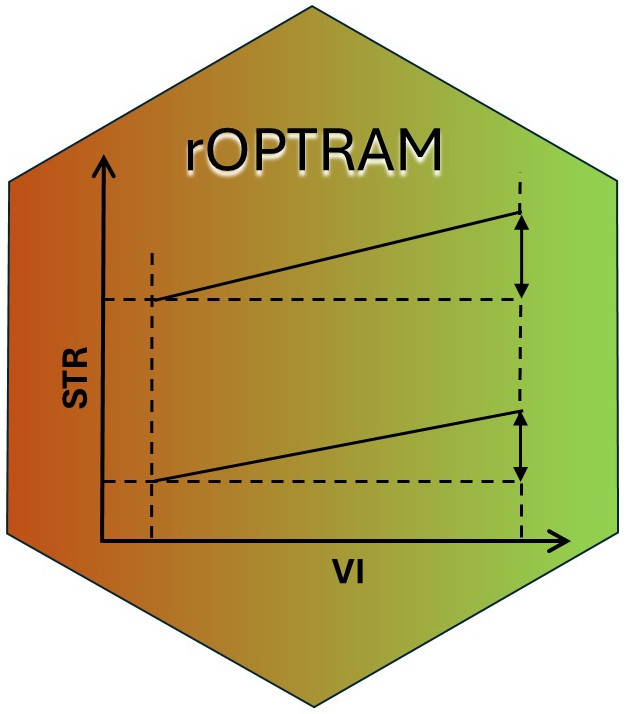

<!-- README.md is generated from README.Rmd. Please edit that file -->


```{r, include = FALSE}
knitr::opts_chunk$set(
  collapse = TRUE,
  comment = "#>",
  fig.path = "man/figures/README-",
  out.width = "100%"
)
```

# rOPTRAM  

<!-- badges: start -->
[](https://www.repostatus.org/#active)
[](https://github.com/ropensci/rOPTRAM/actions/workflows/R-CMD-check.yaml)
[](https://github.com/ropensci/software-review/issues/612)
[](https://zenodo.org/doi/10.5281/zenodo.13257766)
<!-- badges: end -->
[](https://doi.org/10.21105/joss.07086)

`rOPTRAM` implements The OPtical TRapezoid Model (OPTRAM) 
  to derive soil moisture based on the linear relation between a vegetation index, i.e. NDVI, and Shortwave Infra-red (SWIR).  The SWIR band is transformed to SWIR Transformed Reflectance (STR).
  
  A scatterplot of NDVI vs. STR is used to produce wet and dry linear regression lines, and the slope/intercept coefficients of these lines comprise the trapezoid. These coefficients are then used on a new satellite image to determine soil moisture.

  See:  @sadeghi_optical_2017, @burdun_satellite_2020, @ambrosone_retrieving_2020


## Installation

`rOPTRAM` resides on github.
You can install the development version of rOPTRAM like so:

``` {r install, eval=FALSE}
# Install remotes package
if (! require("remotes")) {
  install.packages("remotes")
}
remotes::install_github("ropensci/rOPTRAM")
```

#### Prerequisites

Only a small number of commonly used R packages are required to use {rOPTRAM}. This includes:
 - base packages {tools} and {utils}
 - spatial packages {sf} and {terra}
 - data.frame and plotting {dplyr}, {ggplot2}, {MASS}

Users can download Sentinel-2 tiles from the Copernicus manually, and run thru the steps to produce the OPTRAM trapezoid, and predicted soil moisture maps. However, this approach is not optimal. By installing a few additional packages, the workflow can be initiated by a single function call to download, clip to area of interest, and produce the trapezoid coefficients. The all-inclusive approach is highly recommended since processing of the Sentinel-2 data is performed "in the cloud" and only the final products are downloaded, **greatly** reducing the download file sizes. 

To run the all-inclusive approach, the first step of acquiring Sentinel-2 imagery is handled by the R package {CDSE}. (see @karaman_cdse_2023). The {jsonlite} package is also necessary.

That R package interfaces with the Copernicus DataSpace Ecosystem in one of two ways:
 - Thru the [Scihub API](https://shapps.dataspace.copernicus.eu/dashboard/#/).
 - Thru the [openEO platform](https://openeo.dataspace.copernicus.eu/) 
 
Both methods require [registering](https://dataspace.copernicus.eu/) on the Copernicus DataSpace 

## Available functions

#### optram_options()

Several package options are defined, with default values, when {rOPTRAM} first loads. Each of these can be set individually to user chosen values. For example, the package uses a vegetation index (compared to SWIR Transformed Reflectance) values to plot the trapezoid. The default index is "NDVI". In a low vegetation, arid region, users can choose an alternative such as "SAVI" (see example below). The default maximum cloud cover is set to 12 [%], and users can choose any value between 0-100. 

#### optram()

A main wrapper function to run the whole OPTRAM procedure. 
This function performs the following steps:

  - Acquire Sentinel 2 images covering the requested date range, and clipped to the input area of interest. This step relies on the {CDSE} package
  - Create the set of SWIR Transformed Reflectance (STR) rasters;
  - Prepare a dataframe of NDVI and STR values for all pixels from all images;
  - Calculate the trapezoid wet and dry regression lines, and save coefficients to a CSV file.
Returns: RMSE values of the fitted regression lines of the trapezoid.


#### optram_acquire_s2()
Acquire Sentinel 2 images covering the requested date range, and clipped to the input area of interest.

Among the function parameters, the `method` can be specified as either "scihub" or "openeo", thus choosing one of the two available acqquistion methods.

Returns: a list of downloaded Sentinel 2 images


#### optram_calculate_str()
Extracts the required bands and prepares the vegetation index and SWIR transformed reflectance.

#### optram_ndvi_str()
Collects all pixel values from both the vegetation index and STR rasters, for all acquisition dates, and saves into a data.frame

Returns: the full data.frame


#### optram_wetdry_coefficients()
Calculates the wet-dry trapezoid from the data.frame of NDVI and STR values, and obtains regression slope and intercept for both lines

Three possible fitting methods are offered in this function, thru the "trapezoid_method" parameter. The user can choose to match the upper (wet) and lower (dry) bounds of the trapezoid either as a linear regression line, an exponential curve, or a second order polynomial function.

Returns: the set of four (or six, in the case of polynomial curve) coefficients.

#### optram_calculate_soil_moisture()
Calculates soil moisture rasters for a time series of images, using the OPTRAM model coefficients from above procedure.

#### optram_landsat()
Prepares the OPTRAM coefficients from a time series of Landsat images, (instead of Sentinel). This function requires that the images are downloaded in advance.

Returns: the set of four coefficients.


#### optram_safe()
In case Sentinel images have been downloaded in advance, this function prepares the STR and NDVI rasters, then calculate the trapezoid regression coefficients. It requires an input directory containing the Sentinel 2 images in the original SAFE file format.


## Example

First, a demonstration of choosing non-default package options.

```{r options}
# Show default options
rOPTRAM::optram_options()
# Change one options
rOPTRAM::optram_options("veg_index", "SAVI", show_opts = FALSE)
```

Next a basic example which shows how to:

  - retrieve Sentinel 2 imagery for a specific area of interest
  - covering a date range
  - preprocess the imagery to obtain a vegetation index and STR band
  - use these to derive coefficients of slope and intercept for the OPTRAM trapezoid
  - using the "linear" fitting method

```{r example, eval=FALSE}
library(rOPTRAM)
# basic example
aoi <- sf::st_read(system.file("extdata", "lachish.gpkg", package="rOPTRAM"))
rmse <- rOPTRAM::optram(
    aoi = aoi,
    from_date = "2021-01-01", to_date = "2021-03-30",
    max_cloud = 10)
print(rmse)
```

## Note

In order to download Sentinel 2 images, the {CDSE} package is used: (@karaman_cdse_2023)

That package should be installed in advance in order to run the `optram()` wrapper function.

If, on the other hand, Sentinel 2 imagery has been downloaded in advance, then {CDSE} is not strictly necessary.
Instead, the following workflow can be used:

  - call `optram_safe()` to prepare NDVI and STR rasters
  - call `optram_calculate_str()` to calculate SWIR Transform
  - call `optram_ndvi_str()` to build a data.frame of pixel values
  - call `optram_wetdry_coefficients()` to derive slope and intercept of the trapezoid. 

## Meta

  - Please report any issues on [github](https://github.com/ropensci/rOPTRAM/issues)
  - Anyone interested in collaborating is invited to "sign up" by contacting the maintainers.
  - This package is released with a [Contributor Code of Conduct](https://github.com/ropensci/.github/blob/master/CODE_OF_CONDUCT.md). By contributing to this project, you agree to abide by its terms.
