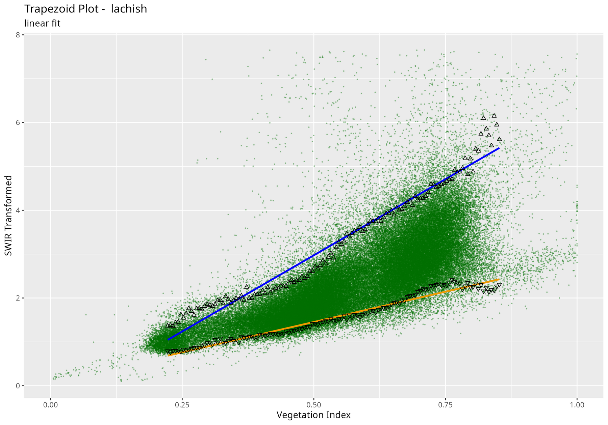

# Abstract

While drylands supply a livelihood to much of the world's rural population, these arid and semi-arid areas are under increased pressure due to both growing demand and the current climate crisis. Maintaining a sustainable food source for rural populations depends on reliable grazing, and the quality of grazing is in turn determined by soil moisture. Thus soil moisture must be monitored to ensure a sustainable food supply. Classic soil moisture monitoring methods rely on sensors, inserted into the soil, that give accurate measurements at high temporal resolution, but at a point location.

However, addressing the needs of populations that depend on extensive grazing lands requires a regional scale soil moisture assessment. Point measurements, albeit accurate, do not afford the needed information to prepare for, or mitigate drought events at regional scale. To this end, remote sensing methods to estimate soil moisture have been developed. Among them, the OPTRAM model has been shown to accurately determine soil moisture over large areas. The `rOPTRAM` package in `R` has implemented that model allowing researchers and practitioners to monitor grazing potential at regional scale and long time intervals.

# Introduction

Soil moisture (SM) at the Earth’s surface is essential in many hydrological, pedological, and biological processes. In the world’s drylands, pasture is the most common land use ramankutty_farming_2008], and SM is critical in these regions for the growth of palatable plants, pasture quality, and rangeland health. Populations living in drylands need high-resolution regional SM predictions to prepare for and mitigate droughts. Across the African Sahel, for example, tens of millions of people depend on herds of grazing animals for food security [@mbow_land_2021; @kusserow_desertification_2017]. A time series of soil moisture measurements can serve to determine the quality and potential for grazing in arid and semi-arid regions. By following seasonal variations in soil moisture, forecasts for preferred grazing lands can be prepared. *In-situ* volumetric soil content is typically measured using Time Domain Reflectometer (TDR) sensors with a high temporal resolution [@kirkham_time_2014]. TDR sensors have been recognized to be very accurate, and can function for long periods. However these data are point measurements, and cannot cover the extensive areas needed for determining regional scale grazing potential. Cosmic Ray Neutron Scanner (CRNS) technology can also acquire SM measurements also at high temporal resolution, with a larger spatial scale than TDR, covering a few hectares. These latter instruments are, however, quite expensive, and less accurate than TDR spot measurements [@davies_optimal_2022; @schron_improving_2017]. To overcome the locality issue, Earth Observations from satellites have been accepted as the most efficient and reliable means for assessing the Earth’s resources, including SM, in isolated and inaccessible regions due to its large-scale coverage and repeatability for the last decades. 

Less than a decade ago, @sadeghi_optical_2017 showed that shortwave infrared (SWIR) Transformed Reflectance (STR) is applicative for to assess SM. They developed a novel physical-based model, OPtical TRApezoid Model (OPTRAM) that uses designated spectral bands of remote sensing imagery. OPTRAM was recently validated [@longo-minnolo_stand-alone_2022] to address the need to estimate SM over vast areas in watershed and regional scales. Consequently the model can now be applied to various earth observation systems, such as Sentinel-2 or Landsat, with visible, near-infrared, and SWIR bands. [@ambrosone_retrieving_2020; @dubinin_using_2020].

The overarching goal of the current project was to program OPTRAM using the open-source R [@r-core-2022] language. Additionally, spectral data was obtained from different spaceborne systems to calculate several vegetation indices, and the model was adjusted to various SM conditions.  


# Algorithm

`rOPTRAM` produces a large dataset of pixel values of two satellite-based raster layers: a vegetation index (VI), such as Normalized Difference Vegetation Index (NDVI) and the STR layer. All pairs of pixel values, at all acquired image dates are plotted as a scatter plot. Then regression lines are extracted at both the upper ("wet") and lower ("dry") bounds of the scatter plot. The slopes and intercepts of these two regression lines are the model coefficients, used to derive a spatially explicit soil moisture map. This soil moisture map is calculated, following @sadeghi_optical_2017, using  \autoref{eq:sm}. In his original work, @sadeghi_optical_2017 used a visual examination of the scatterplot to locate the trapezoid edges.

The new `rOPTRAM` package, on the other hand, delineates the upper and lower, "wet" and "dry" bounds of the VI/STR scatterplot programatically, through the following approach. Sentinel-2 images are acquired, through the `CDSE` package [@karaman_cdse_2023], clipped to the study area, and for the user-specified time range. The API request sent to the Copernicus DataSpace Ecosystem[^1] prepares both VI and STR indices. All pixel values for both indices, and for all images along the time series are collected into a table, and plotted as a scatterplot. The VI axis of the scatterplot is divided, programatically, into a series of small intervals, and a subset of the STR values, within that narrow interval of VI is extracted . Then the top and bottom 5% quartiles of these STR values are found for each of these intervals. The upper quartile values are paired together with the VI values for each interval, thus collecting points along the "wet" trapezoid edge. Similarly the bottom quartile values, paired with VI values, make up the "dry" trapezoid edge. Each of these two sets, typically consisting of 50 to 100 points, is used to delineate the "wet" and "dry" trapezoid edges, thus offering a mathematically robust and repeatable implementation of the OPTRAM model.

One of three possible equations is fitted to each of these "wet" and "dry" sets of trapezoid edges. In the simplest cast, a linear Ordinary Least Squares (OLS) regression line is fitted to each of the sets of points. The intercept and slope of these lines gives the coefficients for calculating soil water content. Two additional fitted options are implemented in `rOPTRAM`: second order polynomial and exponential. In all cases, the fitting function returns the root mean square error (RMSE) of the fitted line to the original 5% quartile trapezoid edges, enabling evaluation of the fitted result.

[^1]: https://dataspace.copernicus.eu/

### Linear regression fit of trapezoid edges

\begin{equation}\label{eq:expdry}
  STR_{dry} = i_{dry} + s_{dry} \cdot VI
\end{equation}

\begin{equation}\label{eq:expwet}
  STR_{wet} = i_{wet} + s_{wet} \cdot VI
\end{equation}

where:
$i_{wet}, i_{dry}$ are the regression line intercepts, and
$s_{wet}, s_{dry}$ are the slopes

Then soil moisture can be derived from:

\begin{equation}\label{eq:sm}
  W = \frac{STR - STR_{dry}}{STR_{wet} - STR_{dry}}
\end{equation}
 

### Second order polynomial fit of trapezoid edges

Polynomial fitted regression lines for the "wet" and "dry" edges can be expressed as:

\begin{equation}
  \label{eq:drypoly}
  STR_{dry} = \alpha_{dry} + \beta1_{dry} \cdot VI + \beta2_{dry} \cdot VI^2
\end{equation}

\begin{equation}
  \label{eq:wetpoly}
  STR_{wet} = \alpha_{wet} + \beta1_{wet} \cdot VI + \beta2_{wet} \cdot VI^2
\end{equation}

and in this case, soil moisture is derived as:

\begin{equation}
  \label{eq:smpoly}
  W = \frac{STR - (\alpha_{dry} + \beta1_{dry} \cdot VI + \beta2_{dry} \cdot VI^2)}{(\alpha_{wet} + \beta1_{wet} \cdot VI + \beta2_{wet} \cdot VI^2) - (\alpha_{dry} + \beta1_{dry} \cdot VI + \beta2_{dry} \cdot VI^2)}
\end{equation}


# Examples

### Setup

Define directories and load required packages

``` r
Output_dir <- tempdir()
# Edit here...
work_dir <- system.file("paper", package = "rOPTRAM") 
GIS_dir <- file.path(work_dir, "GIS")
aoi_file <- file.path(GIS_dir, "lachish.gpkg")

# load libraries
remotes::install_gitlab("rsl-bidr/rOPTRAM")
pkgs <- c("knitr", "ggplot2", "rOPTRAM", "jsonlite")
invisible(lapply(pkgs, require, character.only = TRUE))
# model parameters
veg_index <- "NDVI"
from_date <- "2022-09-01"
to_date <- "2023-04-01"
max_cloud <- 5
```

### Run model, linear trapezoid fitting

Acquiring images from Copernicus DataSpace requires registering and setting up an OAuth client. Refer to the documentation.

```r
BOA_list <- optram_acquire_s2(aoi_file = aoi_file,
                          from_date = from_date,
                          to_date = to_date, 
                          max_cloud = max_cloud,
                          veg_index = veg_index, 
                          output_dir = Output_dir,
                          remote = "scihub")
VI_dir <- file.path(Output_dir, veg_index)
VI_list <- list.files(VI_dir, full.names = TRUE)
STR_dir <- file.path(Output_dir, "STR")
STR_list <- list.files(STR_dir, full.names = TRUE)
VI_STR_df <- optram_ndvi_str(STR_list, VI_list,
                             output_dir = Output_dir,
                             rm.low.vi = TRUE,
                             rm.hi.str = TRUE)

rmse <- optram_wetdry_coefficients(
  VI_STR_df,
  aoi_file = aoi_file,
  output_dir = GIS_dir,
  vi_step = 0.005,
  trapezoid_method = "linear",
  edge_points = TRUE)
```

||RMSE wet edge| RMSE dry edge
|:----------|----------:|----------:|
|Linear fit: |0.2460|0.0955|




### Second run: polynomial fitted curves

Refer to \autoref{eq:smpoly}.

```r
rmse <- optram_wetdry_coefficients(
  VI_STR_df,
  aoi_file = aoi_file,
  output_dir = GIS_dir,
  vi_step = 0.005,
  trapezoid_method = "polynomial",
  edge_points = TRUE)
```

||RMSE wet edge|RMSE dry edge|
|:--------------|---------:|---------:|
|Polynomial fit:| 0.1490| 0.0931|


# Acknowledgements

The authors wish to thank Professor Maxim Shoshany, Faculty of Civil & Environmental Engineering, Technion, Israel, for advice and assistance in supplying relevant data for testing the model and software.

# References

