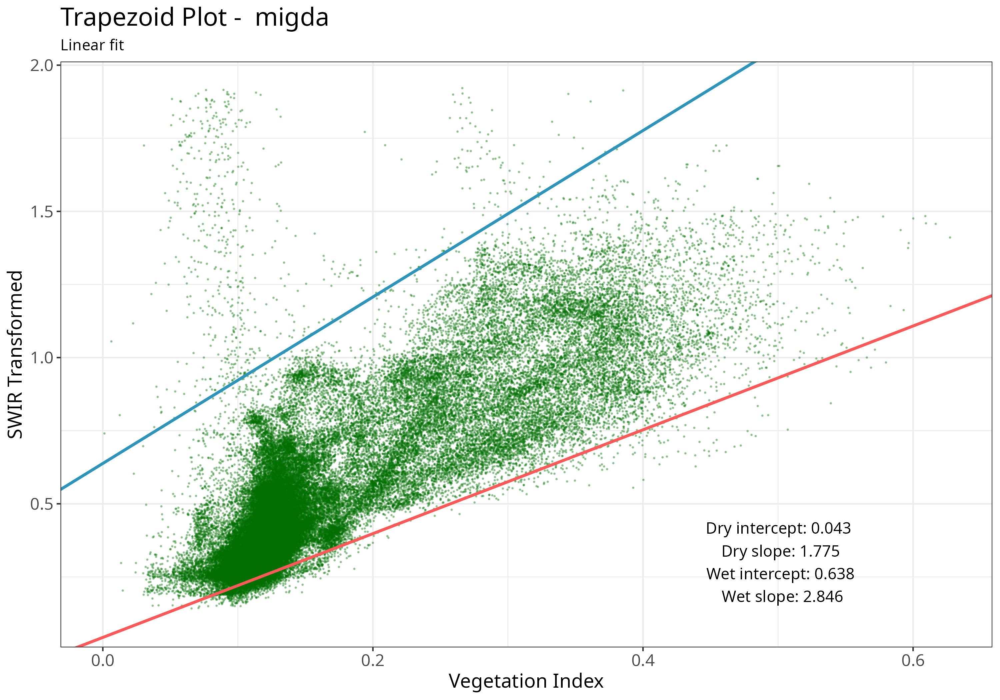

```{r, include = FALSE}
knitr::opts_chunk$set(
  collapse = TRUE,
  message = FALSE,
  comment = "#>"
)
```

## Introduction

`rOPTRAM` implements The OPtical TRapezoid Model (OPTRAM) to derive soil moisture based on the linear relation between a vegetation index, i.e. NDVI, and Land Surface Temperature (LST). The Short Wave Infra-red (SWIR) band is used as a proxy for LST. The SWIR band is transformed to Swir Transformed Reflectance (STR).

A scatterplot of NDVI vs. STR is used to produce wet and dry linear regression lines, and the slope/intercept coefficients of these lines comprise the trapezoid. These coefficients are then used on a new satellite image to determine soil moisture.

  See:  @sadeghi_optical_2017, @burdun_satellite_2020, @ambrosone_retrieving_2020


#### Prerequisites

Only a small number of commonly used R packages are required to use {rOPTRAM}. This includes:

 - base packages {tools} and {utils}
 - spatial packages {sf} and {terra}
 - data.frame and plotting {dplyr}, {ggplot2}

Also, to allow {rOPTRAM} to download Sentinel-2 images, clip to a study area, and prepare the necessary vegetation index and STR products, the R package \CRANpkg{CDSE} (see @karaman_cdse_2023) as well as {jsonlite} are required.

## Workflows

Users can download Sentinel-2 tiles from the Copernicus manually, and run thru the steps one by one to produce the OPTRAM trapezoid, and predicted soil moisture maps. However, this approach is not optimal. The complete workflow can be initiated with a single function call to download, clip to area of interest, and produce the trapezoid coefficients. This all-inclusive approach is highly recommended since processing of the Sentinel-2 data is performed "in the cloud" and only the final products are downloaded, **greatly** reducing the download file sizes.

That recommended R package {CDSE} interfaces with the Copernicus DataSpace Ecosystem in one of two ways:

 - Thru the [Scihub API](https://shapps.dataspace.copernicus.eu/dashboard/#/).
 - Thru the [openEO platform](https://openeo.dataspace.copernicus.eu/)

Both methods require [registering](https://dataspace.copernicus.eu/) on the Copernicus DataSpace


```{r setup, results='hide'}
remotes::install_gitlab("rsl-bidr/roptram")
library(rOPTRAM)
ls(getNamespace('rOPTRAM'))
# The {CDSE} and {jsonlite} packages are required for downloading Sentinel imagery from Copernicus DataSpace.
if (!require("CDSE")) install.packages("sen2r", dependencies = TRUE)
if (!require("jsonlite")) install.packages("jsonlite", dependencies = TRUE)
```

## Main wrapper function

#### Run the full OPTRAM model procedure with a single function call

This example uses sets `timeperiod` to "seasonal", so only images between
the month of from_date and the month of to_date will be used,
but from all years in the date range.

Registration on Copernicus DataSpace was done in advance, and the OAuth credentials (*clientid*, and *secret*) have been saved to the user's home directory.

Downloaded Sentinel-2 images are saved to `S2_output_dir`. For this example, outputs are saved to `tempdir()`

```{r wrapper, warning=FALSE, message=FALSE}
from_date <- "2020-12-01"
to_date <- "2023-03-31"
output_dir <- file.path(tempdir())
aoi_file <- system.file("extdata", "migda.gpkg", package = "rOPTRAM")
veg_index <- "SAVI"
coeffs <- optram(aoi_file,
                 from_date, to_date,
                 veg_index = veg_index,
                 S2_output_dir = output_dir,
                 timeperiod = "seasonal",
                 data_output_dir = output_dir,
                 remote = "scihub")
knitr::kable(coeffs, caption = "Trapezoid coefficients")
```
#### Show trapezoid plot

```{r plot, fig.cap="Trapezoid scatterplot", out.width = '90%', warning=FALSE}
ttl <- "Migda"
coeffs <- read.csv(file.path(output_dir, "coefficients.csv"))
df_file <- file.path(output_dir, "VI_STR_data.rds")
full_df <- readRDS(df_file)
plot_vi_str_cloud(full_df, coeffs, ttl, output_dir = output_dir)

```

## Step by step

#### The same procedure as the wrapper function, but in explicit steps

  - Acquire Sentinel 2 images within a date range, and crop to AOI;
  - Prepare the SWIR Transformed Reflectance;
  - Prepare a data.frame of Vegetation Index and STR values;
  - Get trapezoid coefficients from the scatterplot of VI-STR pixels

This example sets `timeperiod` to "full",
so all images between from_date and to_date will be used.

```{r stepbystep, warning=FALSE, message=FALSE}
from_date <- "2021-10-01"
to_date <- "2023-04-30"
aoi_file <- system.file("extdata", "migda.gpkg", package = "rOPTRAM")
output_dir <- file.path(tempdir())
s2_file_list <- optram_acquire_s2(aoi_file,
                            from_date, to_date,
                            output_dir = output_dir,
                            timeperiod = "full",
                            veg_index =veg_index,
                            remote = "scihub")
STR_list <- list.files(file.path(output_dir, "STR"),
                      pattern = ".tif$", full.names = TRUE)
VI_list <- list.files(file.path(output_dir, "SAVI"),
                      pattern = ".tif$", full.names = TRUE)
full_df <- optram_ndvi_str(STR_list, VI_list,
                           output_dir = output_dir)
coeffs <- optram_wetdry_coefficients(full_df,
                                     aoi_file,
                                     output_dir = output_dir)
knitr::kable(coeffs, caption = "Trapezoid coefficients, full time period")
```


## Soil Moisture Estimate

#### Use trapezoid coefficients, VI, and STR rasters to derive soil moisture grid

```{r soil-moisture}
img_date <- "2023-01-10"   # After a rain
VI_dir <- file.path(output_dir, "SAVI")
STR_dir <- file.path(output_dir, "STR")
coeffs_file <- file.path(output_dir, "coefficients.csv")
SM <- optram_calculate_soil_moisture(img_date, VI_dir, STR_dir, coeffs_file)
```

#### Soil moisture plot

```{r sm-plot}
library(leaflet)
names(SM) <- "Migda soil moisture"
SM[terra::values(SM) < 0] <- 0

sm_map <- leaflet("OpenStreetMap") |>
  addTiles() |>
  addRasterImage(SM,
    colors = colorNumeric("RdYlGn",
      domain = c(-0.1, 2.0), na.color = NA),
    opacity = 0.9)
sm_map
```
