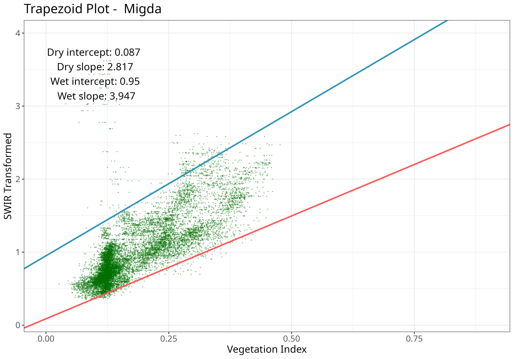

## Introduction

`rOPTRAM` implements The OPtical TRapezoid Model (OPTRAM) to derive soil moisture based on the linear relation between a vegetation index, i.e. NDVI, and Land Surface Temperature (LST). The Short Wave Infra-red (SWIR) band is used as a proxy for LST. The SWIR band is transformed to Swir Transformed Reflectance (STR).

A scatterplot of NDVI vs. STR is used to produce wet and dry linear regression lines, and the slope/intercept coefficients of these lines comprise the trapezoid. These coefficients are then used on a new satellite image to determine soil moisture.

  See:  @sadeghi_optical_2017, @burdun_satellite_2020, @ambrosone_retrieving_2020


#### Prerequisites

This package uses the R package \CRANpkg{sen2r} for acquiring Sentinel-2 imagery.
To install that package you will need some system dependencies.
On Debian and derivatives please install in advance:

  - jq libv8-dev libjq-dev
  - libprotobuf-dev protobuf-compiler

That R package uses the Google Cloud infrastructure to download Sentinel-2 images. To install the Google Cloud CLI for acquiring images follow installation instructions here:
https://cloud.google.com/sdk/docs/install


#### Prepare soil moisture maps covering an area of interest (AOI), over a date range.


```r
remotes::install_gitlab("rsl-bidr/roptram")
library(rOPTRAM)
ls(getNamespace('rOPTRAM'))
#>  [1] "acquire_gcloud"                 "acquire_openeo"                
#>  [3] "acquire_scihub"                 "aoi_to_name"                   
#>  [5] "calculate_str"                  "calculate_vi"                  
#>  [7] "check_aoi"                      "check_date_string"             
#>  [9] "check_gcloud"                   "check_scihub_access"           
#> [11] "optram"                         "optram_acquire_s2"             
#> [13] "optram_calculate_soil_moisture" "optram_calculate_str"          
#> [15] "optram_landsat"                 "optram_ndvi_str"               
#> [17] "optram_prepare_other_vi_str"    "optram_safe"                   
#> [19] "optram_wetdry_coefficients"     "plot_vi_str_cloud"
# The `sen2r` package is required for downloading Sentinel imagery
if (!require("sen2r")) install.packages("sen2r", dependencies = TRUE)
```

## Main wrapper function

#### Run the full OPTRAM model procedure with a single function call

This example uses sets `timeperiod` to "seasonal", so only images between
the month of from_date and the month of to_date will be used,
but from all years in the date range.

The prerequisite Google Cloud CLI utility `gsutil` was installed in advance.
See: [Google Cloud Documention](https://cloud.google.com/sdk/docs/install) for detailed instructions.

Downloaded Sentinel-2 images are saved to `S2_output_dir`. For this example, outputs are saved to `tempdir()`


```r
from_date <- "2021-11-01"
to_date <- "2023-03-31"
S2_dir <- tempdir()
output_dir <- file.path(S2_dir, "Migda_season")
aoi_file <- system.file("extdata", "migda.gpkg", package = "rOPTRAM")
coeffs <- optram(aoi_file,
                 from_date, to_date,
                 veg_index = c("SAVI"),
                 S2_output_dir = output_dir,
                 remove_safe = "no",
                 timeperiod = "seasonal",
                 data_output_dir = output_dir)
#> Reading layer `migda' from data source 
#>   `/home/micha/R/x86_64-pc-linux-gnu-library/4.2/rOPTRAM/extdata/migda.gpkg' 
#>   using driver `GPKG'
#> Simple feature collection with 1 feature and 2 fields
#> Geometry type: POLYGON
#> Dimension:     XYZ
#> Bounding box:  xmin: 34.58346 ymin: 31.35898 xmax: 34.58915 ymax: 31.36169
#> z_range:       zmin: 0 zmax: 0
#> Geodetic CRS:  WGS 84
#> Error in strsplit(date_string): argument "split" is missing, with no default
knitr::kable(coeffs)
```


| intercept_dry| slope_dry| intercept_wet| slope_wet|
|-------------:|---------:|-------------:|---------:|
|     0.0849269|  2.823803|     0.9427332|   3.96976|


## Step by step

#### The same procedure as the wrapper function, but in explicit steps

  - Acquire Sentinel 2 images within a date range, and crop to AOI;
  - Prepare the SWIR Transformed Reflectance;
  - Prepare a data.frame of Vegetation Index and STR values;
  - Get trapezoid coefficients from the scatterplot of VI-STR pixels

This example sets `timeperiod` to "full",
so all images between from_date and to_date will be used.


```r
from_date <- "2022-10-01"
to_date <- "2023-04-30"
aoi_file <- system.file("extdata", "migda.gpkg", package = "rOPTRAM")
output_dir <- file.path(S2_dir, "Migda_full")
s2_file_list <- optram_acquire_s2(aoi_file,
                            from_date, to_date,
                            output_dir = output_dir,
                            remove_safe = "no",
                            timeperiod = "full",
                            veg_index ="SAVI")
#> Reading layer `migda' from data source 
#>   `/home/micha/R/x86_64-pc-linux-gnu-library/4.2/rOPTRAM/extdata/migda.gpkg' 
#>   using driver `GPKG'
#> Simple feature collection with 1 feature and 2 fields
#> Geometry type: POLYGON
#> Dimension:     XYZ
#> Bounding box:  xmin: 34.58346 ymin: 31.35898 xmax: 34.58915 ymax: 31.36169
#> z_range:       zmin: 0 zmax: 0
#> Geodetic CRS:  WGS 84
#> Error in strsplit(date_string): argument "split" is missing, with no default
BOA_dir <- file.path(output_dir, "BOA")
STR_list <- optram_calculate_str(BOA_dir)
VI_list <- list.files(file.path(output_dir, "SAVI"),
                      pattern = ".tif$", full.names = TRUE)
full_df <- optram_ndvi_str(STR_list, VI_list,
                           output_dir = output_dir)
coeffs <- optram_wetdry_coefficients(full_df,
                                     aoi_file,
                                     output_dir = output_dir)
```

#### Show trapezoid plot


```r
ttl <- "Migda"
coeffs <- read.csv(file.path(output_dir, "coefficients.csv"))
df_file <- file.path(output_dir, "VI_STR_data.rds")
full_df <- readRDS(df_file)
plot_vi_str_cloud(full_df, coeffs, ttl, output_dir = output_dir)

```

<div class="figure">

<p class="caption">Trapezoid scatterplot</p>
</div>

## Soil Moisture

#### Use trapezoid coefficients, VI, and STR rasters to prepare soil moisture grid


```r
img_date <- "2023-01-25"   # After a rain
VI_dir <- file.path(output_dir, "SAVI")
STR_dir <- file.path(output_dir, "STR")
coeffs_file <- file.path(output_dir, "coefficients.csv")
SM <- optram_calculate_soil_moisture(img_date, VI_dir, STR_dir, coeffs_file)
```

#### Soil moisture plot


```r
library(leaflet)
names(SM) <- "Migda soil moisture"
SM[terra::values(SM) < 0] <- 0

sm_map <- leaflet("OpenStreetMap") |>
  addTiles() |>
  addRasterImage(SM,
    colors = colorNumeric("RdYlGn",
      domain = c(-0.1, 1.0), na.color = NA),
    opacity = 0.9)
```


```{r, eval=TRUE, echo=FALSE} 
sm_map <- base::readRDS('sm_map.rds') 
```

```{r, eval=TRUE, echo=FALSE} 
sm_map 
```
