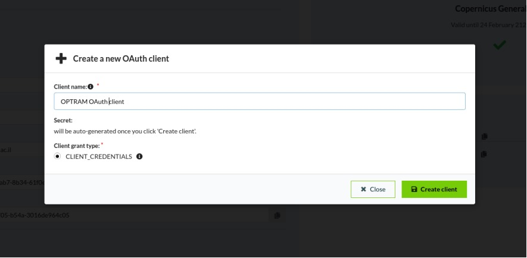
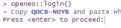

```{r, include = FALSE}
knitr::opts_chunk$set(
  collapse = TRUE,
  message = FALSE,
  comment = "#>"
)
```

## Introduction 

The {CSDE} package provides an interface to the 'Copernicus DataSpace Ecosystem' API, mainly for searching the catalog of available data from Copernicus Sentinel missions and obtaining the images for just the area of interest based on selected spectral bands. The package uses the 'Sentinel Hub' REST API interface [Sentinel Hub](https://dataspace.copernicus.eu/analyse/apis/sentinel-hub) that provides access to various satellite imagery archives. It allows you to access raw satellite data, rendered images, statistical analysis, and other features.

[CDSE CRAN page](https://cran.r-project.org/web/packages/CDSE/index.html)

OpenEO is an open-source project aimed at standardizing and simplifying access to Earth observation data and processing services. It provides a common API that abstracts away the complexities of accessing and processing Earth observation data, allowing users to interact with multiple back-end processing engines through a unified interface.

[openEO CRAN page](https://cran.r-project.org/web/packages/openeo/index.html)

Both methods require [registering](https://dataspace.copernicus.eu/) on the Copernicus DataSpace. This vignette provides a detailed guide on acquiring Sentinel-2 imagery using both the CDSE (Copernicus Data and Exploitation Platform - SciHub) and the openEO platform.

## Acquiring Sentinel-2 Imagery using CDSE

To utilize the CDSE package for accessing Copernicus data, follow these steps:

### Step 1: Install Required Packages

Ensure you have the `CDSE` and `jsonlite` packages installed:

```{r setup, results='hide', eval=FALSE}
remotes::install_gitlab("rsl-bidr/roptram")
library(rOPTRAM)
if (!require("CDSE")) install.packages("CDSE", dependencies = TRUE)
if (!require("jsonlite")) install.packages("jsonlite", dependencies = TRUE)
```

### Step 2: Create CDSE Account and OAuth Client

1.  Navigate to the [Copernicus portal](https://dataspace.copernicus.eu/).
2.  Click the "Register" button to access the account creation page.
3.  If already registered, log in to your account.

### Step 3: Creating OAuth Client:

1.  After logging in, go to the User Settings page.
2.  Click the green "Create New" button to create a new OAuth client.
3.  Enter a suitable "Client Name" and click "Create Client".

{width="630"}

4.  A Client secret will be generated. Make sure to **copy your new personal OAuth secret** immediately after it is created. You will not be able to see it again later.

5.  Copy the new client id.


### Step 4: Saving Credentials:

-   **Save your client ID and secret in a secure location.**
-   Then the easiest option to save your credentials is by using `store_cdse_credentials`. Simply call it with the appropriate client ID and secret as arguments. Alternatively, you can set environment variables `OAUTH_CLIENTID` and `OAUTH_SECRET`.

```{r prepare-save-1, warning=FALSE, message=FALSE, results='hide', eval=FALSE}
# Example usage:
store_cdse_credentials(clientid = "your_client_id", secret = "your_secret_key")

# Alternatively, after setting your environment variables, you can use them like this:
store_cdse_credentials(Sys.getenv("OAUTH_CLIENTID"), Sys.getenv("OAUTH_SECRET"))
```

Afterward, you can utilize either `optram_acquire_s2` or `acquire_scihub`

```{r prepare-save-2, warning=FALSE, message=FALSE, results='hide', eval=FALSE}
# For this example, outputs are saved to `tempdir()`
from_date <- "2018-12-01"
to_date <- "2019-04-30"
# aoi <- "path/to/your/aoi_file.gpkg"
# rOPTRAM_aoi_example
aoi <- system.file("extdata", "lachish.gpkg", package = 'rOPTRAM')

boa_files <- acquire_scihub(aoi,
              from_date, to_date,
              veg_index = "SAVI",
              output_dir = tempdir(),
              SWIR_band = 11)
```

Alternatively, you can use the `save_creds` option. At the first run, set `save_creds = TRUE` and enter your clientid and secret as variables in the `optram_acquire_s2` or `acquire_scihub` functions to automatically save credentials. From there, you can use those functions as shown above without needing to insert credentials again.

```{r prepare-save-3, warning=FALSE, message=FALSE, results='hide', eval=FALSE}
# For this example, outputs are saved to `tempdir()`
from_date <- "2018-12-01"
to_date <- "2019-04-30"
# aoi <- "path/to/your/aoi_file.gpkg"
# rOPTRAM_aoi_example
aoi <- system.file("extdata", "lachish.gpkg", package = 'rOPTRAM')
optram_options("SWIR_band", 11)
optram_options("veg_index", "SAVI")
boa_files <- acquire_scihub(aoi,
              from_date, to_date,
              veg_index = "SAVI",
              output_dir = tempdir(),
               # For the first run, uncomment below, and supply credentials...
               # save_creds = TRUE,
               # clientid = "your_client_id",
               # secret = "your_secret"
               )
```


-   If you choose to use the env option, you can utilize either `optram_acquire_s2` or `acquire_scihub`. To enable the environment variable option, set `save_creds = TRUE` when calling either function. By doing so, you won't need to manually enter your Client ID and secret. Your code snippet might resemble the following:

```{r prepare-save-4, warning=FALSE, message=FALSE, results='hide', eval=FALSE}
from_date <- "2018-12-01"
to_date <- "2019-04-30"
# aoi <- "path/to/your/aoi_file.gpkg"
# rOPTRAM_aoi_example
aoi <- system.file("extdata", "lachish.gpkg", package = 'rOPTRAM')

boa_files <- acquire_scihub(aoi,
              from_date, to_date,
              output_dir = tempdir(),
               # For the first run, uncomment below
               # save_creds = TRUE,
             )
# It will trigger the store_cdse_credentials function from utilities.R, and your
# credentials will be saved as a JSON file named cdse_credentials.json.
```

### Step 5: Acquire Sentinel-2 Imagery

For further downloads the credentials are not needed. (They have been saved to the user's home directory)

```{r acquire-1, warning=FALSE, message=FALSE, results='hide', eval=FALSE}
from_date <- "2019-12-01"
to_date <- "2020-04-30"
boa_files <- acquire_scihub(aoi, from_date, to_date,
               output_dir = tempdir())
```

## Acquiring Sentinel-2 Imagery using openEO

To use openEO for accessing Copernicus data, follow these steps:

### Step 1: Install Required Packages

Ensure you have the `openeo` package installed:

```{r acquire-2, eval=FALSE}
# install.packages("openeo")
if (!require("openeo")) install.packages("openeo", dependencies = TRUE)
```

### Step 2: Connect to openEO Platform

#### Registration Process:

For detailed instructions on how to register for the Copernicus Data Space, please visit: [Registration Manual](https://documentation.dataspace.copernicus.eu/Registration.html)

#### Login Process:

A. When you run the `acquire_openeo()` function, it internally calls the `check_openeo()` function. If the `openeo` package is not installed, it will be installed automatically.

B. When prompted, press enter to proceed.



C. You will be redirected to the Copernicus authentication page. Log in and grant access.

{width="476"}

{width="476"}

### Step 3: Acquire Sentinel-2 Imagery

You can specify your `output_dir` parameter to indicate the path where downloaded and processed imagery will be saved. For this example, outputs are saved to `tempdir()`

```{r acquire-3, eval=FALSE}
from_date <- "2018-12-01"
to_date <- "2019-03-30"

acquire_openeo(aoi, from_date, to_date,
               output_dir = tempdir())
```

## Conclusion

This vignette provides comprehensive instructions for acquiring Sentinel-2 imagery using both CDSE and openEO platforms. Ensure you have the necessary credentials and packages installed to access Copernicus data efficiently.
