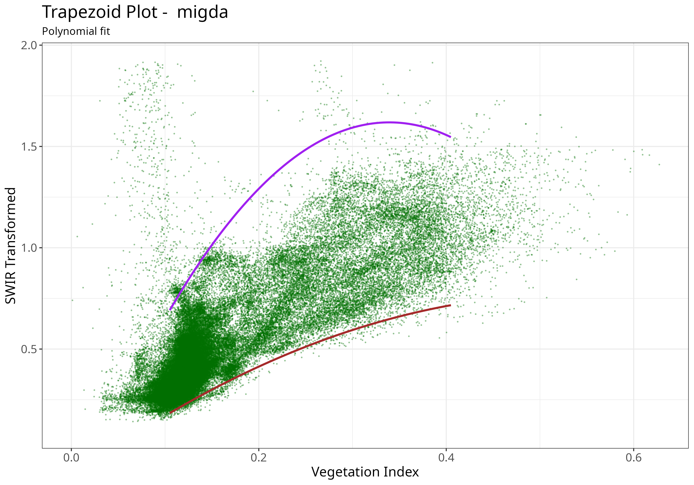

```{r, include = FALSE}
knitr::opts_chunk$set(
  collapse = TRUE,
  message = FALSE,
  comment = "#>"
)
```

## Introduction

@ma_combining_2022


## Examples


```{r setup, results='hide'}
remotes::install_gitlab("rsl-bidr/roptram")
library(rOPTRAM)
if (!require("CDSE")) install.packages("sen2r", dependencies = TRUE)
if (!require("jsonlite")) install.packages("jsonlite", dependencies = TRUE)
```
#### Prepare data.frame of pixel values for full time range

```{r prepare, warning=FALSE, message=FALSE}
from_date <- "2020-12-01"
to_date <- "2023-03-31"
output_dir <- file.path(tempdir())
aoi_file <- system.file("extdata", "migda.gpkg", package = "rOPTRAM")
veg_index <- "SAVI"
s2_file_list <- optram_acquire_s2(aoi_file,
                            from_date, to_date,
                            output_dir = output_dir,
                            timeperiod = "full",
                            veg_index =veg_index)
STR_list <- list.files(file.path(output_dir, "STR"),
                      pattern = ".tif$", full.names = TRUE)
VI_list <- list.files(file.path(output_dir, "SAVI"),
                      pattern = ".tif$", full.names = TRUE)
full_df <- optram_ndvi_str(STR_list, VI_list,
                           output_dir = output_dir)
```

#### Show Linear trapezoid plot

```{r plot, fig.cap="Trapezoid scatterplot", out.width = '90%', warning=FALSE}
ttl <- "Migda"
meth <- "linear"
coeffs <- optram_wetdry_coefficients(full_df,
                                     aoi_file = aoi_file,
                                     output_dir = output_dir,
                                     trapezoid_method = meth)
plot_vi_str_cloud(full_df, coeffs, ttl,
                  output_dir = output_dir, trapezoid_method = meth)
knitr::include_graphics("trapezoid_migda.png")
```

#### Show Exponential fitted trapezoid plot

```{r plot, fig.cap="Trapezoid scatterplot", out.width = '90%', warning=FALSE}
ttl <- "Migda"
meth <- "exponential"
coeffs <- optram_wetdry_coefficients(full_df,
                                     aoi_file = aoi_file,
                                     output_dir = output_dir,
                                     trapezoid_method = meth)
plot_vi_str_cloud(full_df, coeffs, ttl,
                  output_dir = output_dir,
                  trapezoid_method = meth)
knitr::include_graphics("trapezoid_migda_exp.png")
```

#### Show Polynomial fitted trapezoid plot

```{r plot, fig.cap="Trapezoid scatterplot", out.width = '90%', warning=FALSE}
ttl <- "Migda"
meth <- "polynomial"
coeffs <- optram_wetdry_coefficients(full_df,
                                     aoi_file = aoi_file,
                                     output_dir = output_dir,
                                     trapezoid_method = meth)
plot_vi_str_cloud(full_df, coeffs, ttl,
                  output_dir = output_dir,
                  trapezoid_method = meth)

```
