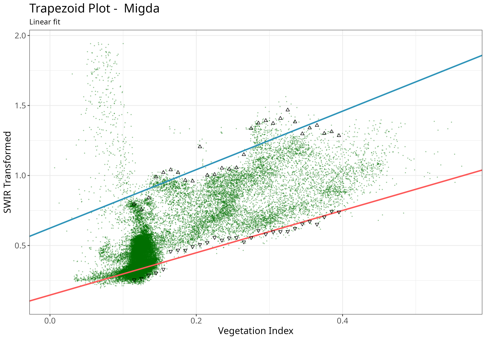
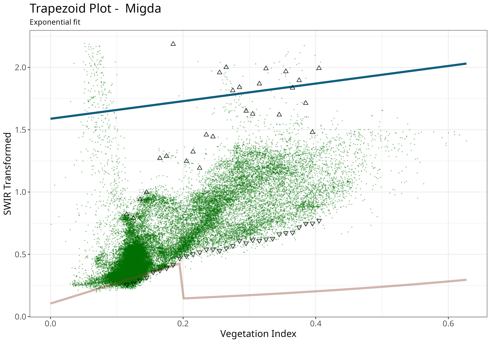

```{r, include = FALSE}
knitr::opts_chunk$set(
  collapse = TRUE,
  message = FALSE,
  comment = "#>"
)
```

## Introduction

The algorithm for finding trapezoid wet and dry edges works as follows:

After acquiring a time series of Sentinel-2 images over the study area, both vegetation index (i.e. NDVI or SAVI), and SWIR Transformed Reflectance (STR) rasters are prepared. Pixel values of both indices for all images are collected into a two column table (and plotted as a scatterplot). The vegetation axis (x-axis) is split into a large number of intervals (usually between 50 - 100). The width of each interval is configurable by the user through the `step` parameter in `optram_wetdry_coefficients()`. Then for each interval the top and bottom 1% quantiles of STR values are determined. These point values - VI and STR - are considered to create the fitted wet and dry trapezoid edges.

Three fitting methods are available in {rOPTRAM} to prepare the trapezoid wet and dry edges. For detailed background, see:  @ma_combining_2022. Users can choose between a 

 - linear OLS fitted line
 - exponential fit
 - second order polynomial
 
Both the linear and the polynomial fit are derived using the `lm` function in the `R` {stats} package. The exponential fit uses the equation: 
$$STR = i \cdot e^{(s \cdot VI)}$$
where STR is the fitted STR value, $i$, and $s$ are the linear regression intercept, and slope, and $VI$ is the vegetation index value.

The fitting method is chosen by setting the `trapezoid_method` parameter in the `optram_wetdry_coefficients()` function.

## Examples


```{r setup, results='hide'}
remotes::install_gitlab("rsl-bidr/roptram")
library(rOPTRAM)
if (!require("CDSE")) install.packages("CDSE", dependencies = TRUE)
if (!require("jsonlite")) install.packages("jsonlite", dependencies = TRUE)
```

#### Prepare data.frame of pixel values

```{r prepare, warning=FALSE, message=FALSE, results='hide'}
from_date <- "2022-05-01"
to_date <- "2023-04-30"
output_dir <- file.path(tempdir())
aoi_file <- system.file("extdata", "migda.gpkg", package = "rOPTRAM")
veg_index <- "SAVI"
s2_file_list <- optram_acquire_s2(aoi_file,
                            from_date, to_date,
                            output_dir = output_dir,
                            veg_index =veg_index,
                            remote = "scihub")
STR_list <- list.files(file.path(output_dir, "STR"),
                      pattern = ".tif$", full.names = TRUE)
VI_list <- list.files(file.path(output_dir, "SAVI"),
                      pattern = ".tif$", full.names = TRUE)
full_df <- optram_ndvi_str(STR_list, VI_list,
                           output_dir = output_dir,
                           rm.low.vi = TRUE, rm.hi.str = TRUE)
```

#### Show Linear trapezoid plot

```{r plot-linear, fig.cap="Trapezoid scatterplot", out.width = '90%', warning=FALSE}
ttl <- "Migda"
meth <- "linear"
coeffs <- optram_wetdry_coefficients(full_df,
                                     aoi_file = aoi_file,
                                     output_dir = output_dir,
                                     trapezoid_method = meth,
                                     save_plot = FALSE)
plot_vi_str_cloud(full_df, coeffs, ttl,
                  output_dir = output_dir,
                  trapezoid_method = meth,
                  edges_points = TRUE)

```

#### Show Exponential fitted trapezoid plot

```{r plot-exp, fig.cap="Exponential fit trapezoid scatterplot", out.width = '90%', warning=FALSE}
ttl <- "Migda"
meth <- "exponential"
coeffs <- optram_wetdry_coefficients(full_df,
                                     aoi_file = aoi_file,
                                     output_dir = output_dir,
                                     trapezoid_method = meth,
                                     save_plot = FALSE)
plot_vi_str_cloud(full_df, coeffs, ttl,
                  output_dir = output_dir,
                  trapezoid_method = meth,
                  edges_points = TRUE)

```

#### Show Polynomial fitted trapezoid plot

```{r plot-poly, fig.cap="Polynomial fit trapezoid scatterplot", out.width = '90%', warning=FALSE}
ttl <- "Migda"
meth <- "polynomial"
coeffs <- optram_wetdry_coefficients(full_df,
                                     aoi_file = aoi_file,
                                     output_dir = output_dir,
                                     trapezoid_method = meth,
                                     save_plot = FALSE)
plot_vi_str_cloud(full_df, coeffs, ttl,
                  output_dir = output_dir,
                  trapezoid_method = meth,
                  edges_points = TRUE)
knitr::include_graphics("trapezoid_Migda_polynomial.png")
```
