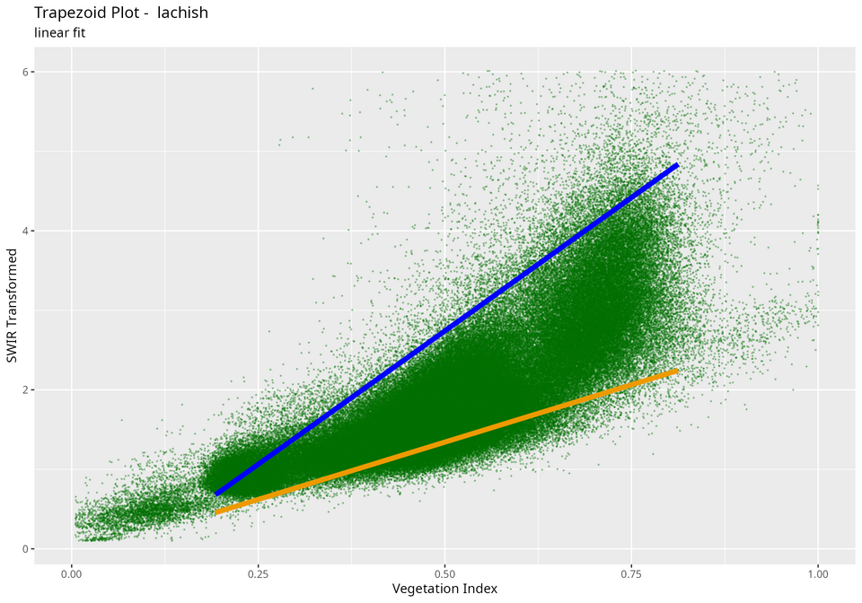

## Introduction  

The algorithm for finding trapezoid wet and dry edges works as follows:

After acquiring a time series of Sentinel-2 images over the study area, both vegetation index (i.e. NDVI or SAVI), and SWIR Transformed Reflectance (STR) rasters are prepared. Pixel values of both indices for all images are collected into a two column table (and plotted as a scatterplot). The vegetation axis (x-axis) is split into a large number of intervals (usually between 50 - 100). The width of each interval is configurable by the user through the `vi_step` parameter in `optram_wetdry_coefficients()`. Then for each interval the top and bottom 5% quantiles of STR values are determined. These point values - VI and STR - are considered to create the fitted wet and dry trapezoid edges.

Three fitting methods are available in {rOPTRAM} to prepare the trapezoid wet and dry edges. For detailed background, see:  @ma_combining_2022. Users can choose between a

 - linear OLS fitted line
 - exponential fit
 - second order polynomial

All fitting methods are derived using the `lm` function in the `R` {stats} package.

The linear OLS fit follows:
$$STR = i + s \cdot VI$$
The exponential fit uses the equation:
$$STR = i \cdot e^{(s \cdot VI)}$$
where STR is the fitted STR value, $i$, and $s$ are the exponential regression intercept, and coefficient and $VI$ is the vegetation index value.

The polynomial fit uses:

$$ STR = \alpha + \beta1 \cdot VI + \beta2 \cdot VI^2$$

The fitting method is chosen by setting the `trapezoid_method` parameter in the `optram_wetdry_coefficients()` function.

## Examples


```r
remotes::install_gitlab("rsl-bidr/roptram")
library(rOPTRAM)
if (!require("CDSE")) install.packages("CDSE", dependencies = TRUE)
if (!require("jsonlite")) install.packages("jsonlite", dependencies = TRUE)
```

#### Prepare data.frame of pixel values


```r
from_date <- "2022-05-01"
to_date <- "2023-04-30"
output_dir <- tempdir()
aoi <- sf::st_read(system.file("extdata",
                            "lachish.gpkg", package = "rOPTRAM"))
veg_index <- "NDVI"
s2_file_list <- optram_acquire_s2(aoi,
                            from_date, to_date,
                            output_dir = output_dir,
                            veg_index =veg_index,
                            remote = "scihub",
                            SWIR_band = 11)
STR_list <- list.files(file.path(output_dir, "STR"),
                      pattern = ".tif$", full.names = TRUE)
VI_list <- list.files(file.path(output_dir, "NDVI"),
                      pattern = ".tif$", full.names = TRUE)
full_df <- optram_ndvi_str(STR_list, VI_list,
                           output_dir = output_dir,
                           rm.low.vi = TRUE, rm.hi.str = TRUE)
```

#### Show Linear trapezoid plot


```r
meth <- "linear"
rmse <- optram_wetdry_coefficients(full_df,
                                   output_dir = output_dir,
                                   trapezoid_method = meth)
edges_df <- read.csv(file.path(output_dir, "trapezoid_edges_lin.csv"))
pl <- plot_vi_str_cloud(full_df,  edges_df = edges_df,
                  trapezoid_method = meth, edge_points = TRUE)
```


```r
pl <- pl + ggplot2::ggtitle("Lachish area trapezoid plot",
                            subtitle = paste(meth, "fitted"))
ggplot2::ggsave(file.path(output_dir, paste0("trapezoid_lachish_", meth, ".png")),
                width = 18, height = 12, units = "cm")
```


```r
knitr::include_graphics(paste0("images/trapezoid_lachish_", meth, ".png"))
```



#### Show Exponential fitted trapezoid plot


```r
meth <- "exponential"
rmse <- optram_wetdry_coefficients(full_df,
                                   output_dir = output_dir,
                                   trapezoid_method = meth)
edges_df <- read.csv(file.path(output_dir, "trapezoid_edges_exp.csv"))
pl <- plot_vi_str_cloud(full_df,  edges_df = edges_df,
                  trapezoid_method = meth, edge_points = TRUE)
```


```r
pl <- pl + ggplot2::ggtitle("Lachish area trapezoid plot",
                            subtitle = paste(meth, "fitted"))
ggplot2::ggsave(file.path(output_dir, paste0("trapezoid_lachish_", meth, ".png")),
                width = 18, height = 12, units = "cm")
```


```r
knitr::include_graphics(paste0("images/trapezoid_lachish_", meth, ".png"))
```


#### Show Polynomial fitted trapezoid plot


```r
meth <- "polynomial"
coeffs <- optram_wetdry_coefficients(full_df,
                                     output_dir = output_dir,
                                     trapezoid_method = meth,
                                     save_plot = TRUE)
#> Error in optram_wetdry_coefficients(full_df, output_dir = output_dir, : unused argument (save_plot = TRUE)
edges_df <- read.csv(file.path(output_dir, "trapezoid_edges_poly.csv"))
pl <- plot_vi_str_cloud(full_df,  edges_df = edges_df,
                  trapezoid_method = meth, edge_points = TRUE)
```


```r
pl <- pl + ggplot2::ggtitle("Lachish area trapezoid plot",
                            subtitle = paste(meth, "fitted"))
ggplot2::ggsave(file.path(output_dir, paste0("trapezoid_lachish_", meth, ".png")),
                width = 18, height = 12, units = "cm")
```


```r
knitr::include_graphics(paste0("images/trapezoid_lachish_", meth, ".png"))
```


